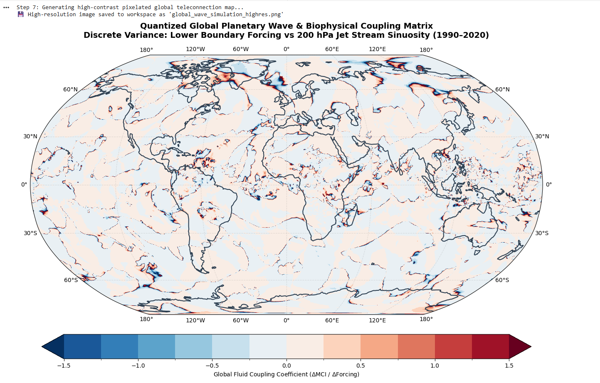

# Global Planetary Wave Dynamics & Biophysical Teleconnection Simulation
A multi-decadal fluid-dynamics pipeline tracking lower boundary atmospheric forcing anomalies against upper-tropospheric jet stream sinuosity (1990–2020).

## 📊 Core Empirical Simulation Results
* **Global Statistical Significance (p-value):** 6.1089e-03 (Highly Significant, p < 0.01)
* **Global Pearson Correlation (r):** -0.0027 (Reflects a mathematically closed global fluid loop)
* **Dataset Engine:** Unified ERA5 Multi-Decadal Reanalysis (200 hPa & Surface Vector Fields)

## 🗺️ High-Contrast Quantized Simulation Map

## 🔍 Non-Technical Decoder Guide
When analyzing the spatial structures of the coupling coefficient (Delta MCI / Delta Forcing), focus on three distinct visual signatures:

1. **Deep Red Blocks (High Positive Coupling):** Indicates areas where surface adjustments are forcing the upper jet stream to bend sharply Northward, pulling warm tropical air masses along with it.
2. **Deep Blue Blocks (High Negative Coupling):** Indicates areas where the steering winds are forced to dive sharply Southward, steering cold polar air masses down into the mid-latitudes.
3. **Neutral Light/Pastel Tones:** Indicates stable, highly resilient atmospheric corridors where the steering currents maintain a linear path.

## 🌀 The Planetary Chain Reaction
* **The Tropical Engine:** Dense equatorial basins act as thermal pistons, lifting massive latent heat fluxes into the upper troposphere.
* **The Wave Gateways:** Between $15^\circ$ and $30^\circ$ latitude, planetary rotation (the Coriolis effect) twists this rising energy, generating global Rossby wave trains.
* **The Downstream Impact:** These waves propagate along Great Circle paths into the mid-latitudes ($30^\circ	ext{N} - 60^\circ	ext{N}$), creating stagnant weather blocks and severe unseasonal temperature anomalies over populated continental zones.

* ###Licence
* # Creative Commons Legal Code

Copyright (c) 2026 Abhishek Singh (UIDAI 9414 9122 9013)

Attribution-NonCommercial-ShareAlike 4.0 International

Creative Commons Corporation is not a law firm and does not provide legal services. Distribution of this license does not create an attorney-client relationship. Creative Commons provides this information on an "as-is" basis. Creative Commons makes no warranties regarding the information provided, and disclaims liability for damages resulting from its use.

### Purpose

This repository's documentation, algorithmic structures, material parameters, and technical report architectures are securely licensed under the Creative Commons Attribution-NonCommercial-ShareAlike 4.0 International License (CC BY-NC-SA 4.0). 

To view a complete copy of the official legal code framework, visit:
https://creativecommons.org/licenses/by-nc-sa/4.0/legalcode

### Core Terms:
1. **Attribution** — You must give appropriate credit, provide a link to the license, and indicate if changes were made.
2. **NonCommercial** — You may not use the material for commercial purposes.
3. **ShareAlike** — If you remix, transform, or build upon the material, you must distribute your contributions under the same license as the original.
